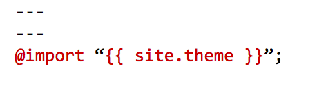
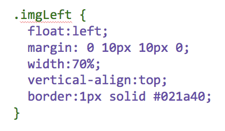

<h1>HTML and CSS Part 2</h1>
<h2>Introduction</h2>
<p>We know we can insert style rules into HTML tags, using the <code>style=""</code> attribute.</p>
<p>However, a more efficient way to accomplish this is by using an external stylesheet. Using an external stylesheet enables us to specify a set of style rules that we can then apply within our HTML tags. This tutorial shows you how to do this.</p>
<hr>
<h2>1. Review: inline styles</h2>
<p>You remember from previous practice, that we can insert an image into our page, like this:</p>

<p>To recap, the code for this is:</p>

<div class="codeblock">
&lt;img  src="https://upload.wikimedia.org/wikipedia/commons/3/39/Europe_biogeography_countries.svg" alt="image of biogeography of Europe"&gt;
</div>

<p>And we have seen that by inserting a style rule into the tag, we can manipulate the position of the image, like this:</p> 


<p>The style rule for this is:</p>
<div class="codeblock"> 
&lt;img <span style="text-decoration:underline; color:#009922;">style="width:70%; border:1px solid green;"</span> src="https://upload.wikimedia.org/wikipedia/commons/3/39/Europe_biogeography_countries.svg" alt="image of biogeography of Europe" &gt;
</div>

<p>Now we are going to see how to wrap text alongside the image, which is a good way to place an image within a paragraph of text. Here is the above image with text wrapped to the right.</p>

<p>

The map to the left shows the biogeography of Europe. Biogeography is the study of the distribution of species and ecosystems in geographic space and through geological time. Organisms and biological communities often vary in a regular fashion along geographic gradients of latitude, elevation, isolation and habitat area. Phytogeography is the branch of biogeography that studies the distribution of plants. Zoogeography is the branch that studies distribution of animals. Source: <a href="https://en.wikipedia.org/wiki/Biogeography">Wikipedia</a>

</p>

<p>The style rule for the above now looks like this:</p>
<div class="codeblock"> 
&lt;img <span style="text-decoration:underline; color:#009922;">style="width:70%; border:1px solid green; float:left; margin: 0 10px 10px 0;"</span> src="https://upload.wikimedia.org/wikipedia/commons/3/39/Europe_biogeography_countries.svg" alt="image of biogeography of Europe" &gt;
</div>
<p>As you can see, the style rule is becoming quite long and complex. This makes it more difficult to read, to detect errors, and is time-consuming to include in every image on your website that you wish to apply the style to.</p>
<p>So this where an external style sheet proves indispensible.</p>

<hr>
<h2>2. Adding external style sheets.</h2>
<h3>2.1. About external style sheets</h3>
<p>External style sheets are useful because they enable you to create a style rule once. You can then reference that style in your HTML tags and the browser will apply the style. This section shows you how to do this, using the image and text as an example.</p>

<h3>2.2. Setting up the style sheet and creating a rule</h3>
<p>The first thing we need to do is set up the external stylesheet. An external stylesheet is simply a file containing the style rules you want your site to use. On a GitHub pages site, we have to create two new directories and the file, like this:</p>
<ol>
  <li>In your site code repository add a new file: assets/css/style.scss</li>
  <li>Insert the following lines exactly as shown to the top of the style.scss file: </li>
  <li>Next, add the following code below the lines shown in the image above: </li>
  <li>Commit the changes to the scss file.</li>
  <li>Now go back to your HTML page, and change the img tag entry as follows: <code> 
    &lt;img <span style="text-decoration:underline; color:#009922;">class="imgLeft"</span> src="https://upload.wikimedia.org/wikipedia/commons/3/39/Europe_biogeography_countries.svg" alt="image of biogeography of Europe" &gt;
    </code></li>
  <li>Finally, commit the changes to the file and view the result.</li>
</ol>

<p>In the above steps, we created a style sheet named 'style.scss' [steps 1 & 2]. (Note: SCSS stands for 'sassy cascading style sheets', which is a style sheet language that uses the same syntax as CSS). We then took the style code from the image tag and created our own style rule named <code> .imgLeft </code>  [step 3]. The dot in front of the style rule name creates what is known as a <b>style class</b>. You can name style classes as you like, but it's best practice to use an accepted form. The form I've used here is called 'camel case' in which a capital letter is used to identify the second part of the class name (Left). This is a standard used in programming and scripting, but many developers prefer to use hypenated names (e.g. .img-left) for better readability. It's up to you. But <b>never</b> put spaces between your class names (e.g. .img left). This will not work. </p>
<p>The other important points to notice in the style code are this:</p>
<ul>
  <li>The style rule is surrounded by curly brackets: <code> { } </code>.</li>
  <li>Each style property is separated from its values by a colon <code> : </code></li>
  <li>Each style property and its values end with a semi-colon <code> ; </code></li>
  </ul>
<p>Study the code carefully. Code is very strict about syntax, so any mistakes in punctuation or the use of illegal characters (e.g. ") will cause errors and your page will either fail to publish or will dispaly incorrectly.</p>
<p>Finally, [step 5] we inserted <code> class="imgLeft" </code>  into our img tag to reference the style sheet rule. Notice that in the class declaration, we do not need to place the dot (.) before the name of the class in the HTML tag. We must use <code> class="" </code> instead.</p>

<h3>2.3. Inserting the text around the image</h3>
<p>The final thing we need to do is wrap a paragraph around our image tag and include the text we want to display next to the image. This is easy to do. In my example above, it looks like this:</p>
<p>
<div class="codeblock">
  &lt;p&gt;<br> 
  
&lt;img class="imgLeft" src="https://upload.wikimedia.org/wikipedia/commons/3/39/Europe_biogeography_countries.svg" alt="image of biogeography of Europe" &gt;
  <br>
  
My paragraph of text goes here. After the image tag, but before the closing p tag.
<br>
  &lt;/p&gt;
</div>
  </p>
  
  <p>Notice in the above that I have put a &lt;p&gt; tag before the image tag, and a &lt;/p&gt; tag after the paragraph of text.</p>
  
<h3>2.4. Tweaking the style</h3>
<p>Finally, in my example image in this page, I originally set the image width to 70%. But I now want the text to have equal space next to the image, so I have changed the style width to 50%, so that the image is 50% wide, which gives the text an equal (50%) space next to the image. Here is the result:</p>
<p>

The map to the left shows the biogeography of Europe. Biogeography is the study of the distribution of species and ecosystems in geographic space and through geological time. Organisms and biological communities often vary in a regular fashion along geographic gradients of latitude, elevation, isolation and habitat area. Phytogeography is the branch of biogeography that studies the distribution of plants. Zoogeography is the branch that studies distribution of animals. Source: <a href="https://en.wikipedia.org/wiki/Biogeography">Wikipedia</a>
</p>
<h3>2.5. Applying the style to other elements</h3>
<p>In this tutorial, I have used the .imgLeft style on the img tag. But you could also apply this style to a paragraph tag. For example:</p>
<p class="imgLeft">Stands for "Cascading Style Sheet." Cascading style sheets are used to format the layout of Web pages. They can be used to define text styles, table sizes, and other aspects of Web pages that previously could only be defined in a page's HTML.</p>
<p style="clear:both;">The above example doesn't look very pretty, but it does demonstrate the usefulness of CSS classes.</p>

<hr>
<h2>Update</h2>
<p>I've been working on a neater way to position images and text side-by-side, with the added feature of adjusting to screen sizes</p>
<p>The code entries below can be pasted directly into your GitHub page</p>

<h3>CSS Code</h3>
<p>First set up the style rules on one of your github pages. Do this by copying the code block below and pasting into your page:</p>

```
<style>
* {
  box-sizing: border-box;
}

/* Create two equal columns that floats next to each other */

.column {
  float: left;
  width: 50%;
  padding: 10px;
}

/* Border around the container */

.row {
   border: 1px solid black;
}

/* Clear floats after the columns */

.row:after {
  content: "";
  display: table;
  clear: both;
}

/* Responsive layout - makes the two columns stack on top of each other instead of next to each other */

@media screen and (max-width: 600px) {
  .column {
    width: 100%;
  }
}
</style>

```
<h3>HTML Code</h3>
<p>Next, paste this HTML code block into your page:</p>  
<p>Note: You can change the image URL and text to whatever you want to present on your page:</p>

```
<div class="row">
  <div class="column">
    <h2>Column 1</h2>
    <p></p>
  </div>
  <div class="column">
    <h2>Column 2</h2>
    <p>The West African giraffe (G. c. peralta) is endemic to south-western Niger.[24] This animal has a lighter pelage than other subspecies,[40]:322 with red lobe-shaped blotches that reach below the hocks. The ossicones are more erect than in other subspecies and males have well-developed median lumps.[33]:52–53 It is the most endangered subspecies within Giraffa, with 400 individuals remaining in the wild.[24] Giraffes in Cameroon were formerly believed to belong to this species, but are actually G. c. antiquorum.[32] This error resulted in some confusion over its status in zoos, but in 2007, it was established that all "G. c. peralta" kept in European zoos actually are G. c. antiquorum. The same 2007 study found that The West African giraffe was more closely related to the Rothschild's giraffe than the Kordofan and its ancestor may have migrated from eastern to northern Africa and then to its current range with the development of the Sahara Desert. At its largest, Lake Chad may have acted as a barrier between West African and Kordofan giraffes during the Holocene (before 5000 BC).[32]</p>
  </div>
</div>

```
<h3>Result</h3>
<p>Your image and text should look something like this:</p>

<style>
* {
  box-sizing: border-box;
}

/* Create two equal columns that floats next to each other */

.column {
  float: left;
  width: 50%;
  padding: 10px;
}

/* Border around the container */

.row {
   border: 1px solid black;
}

/* Clear floats after the columns */

.row:after {
  content: "";
  display: table;
  clear: both;
}

/* Responsive layout - makes the two columns stack on top of each other instead of next to each other */

@media screen and (max-width: 600px) {
  .column {
    width: 100%;
  }
}

</style>

<div class="row">
  <div class="column">
    <h2>Column 1</h2>
    <p></p>
  </div>
  <div class="column">
    <h2>Column 2</h2>
    <p>The West African giraffe (G. c. peralta) is endemic to south-western Niger.[24] This animal has a lighter pelage than other subspecies,[40]:322 with red lobe-shaped blotches that reach below the hocks. The ossicones are more erect than in other subspecies and males have well-developed median lumps.[33]:52–53 It is the most endangered subspecies within Giraffa, with 400 individuals remaining in the wild.[24] Giraffes in Cameroon were formerly believed to belong to this species, but are actually G. c. antiquorum.[32] This error resulted in some confusion over its status in zoos, but in 2007, it was established that all "G. c. peralta" kept in European zoos actually are G. c. antiquorum. The same 2007 study found that The West African giraffe was more closely related to the Rothschild's giraffe than the Kordofan and its ancestor may have migrated from eastern to northern Africa and then to its current range with the development of the Sahara Desert. At its largest, Lake Chad may have acted as a barrier between West African and Kordofan giraffes during the Holocene (before 5000 BC).[32]</p>
  </div>
</div>

<p>Reference: the basics of this code are available <a href="https://www.w3schools.com/howto/tryit.asp?filename=tryhow_css_two_columns_responsive">on W3Schools</a>
  
<hr>

  <h2>3. Homework</h2>
  <p>If you haven't already created the style sheet and modified the image, please follow this tutorial and do so.</p>
  <p>If you have already created the style sheet and formatted your image, then please modify the style rule in your style.scss file and set the image width to 50%.</p>
  <p>Then, go to the W3Schools website and check the following tutorials on using CSS</p>
<ol>
  <li><a href="https://www.w3schools.com/css/css_syntax.asp">CSS Syntax</a></li>
  <li><a href="https://www.w3schools.com/css/css_float.asp">CSS Float</a></li>
  <li><a href="https://www.w3schools.com/css/css_margin.asp">CSS Margin</a></li>
  <li><a href="https://www.w3schools.com/cssref/pr_dim_width.asp">CSS Width</a></li>
  <li><a href="https://www.w3schools.com/cssref/pr_pos_vertical-align.asp">CSS Vertical Align</a></li>
  <li><a href="https://www.w3schools.com/css/css_border.asp">CSS Borders</a></li>
  </ol>

