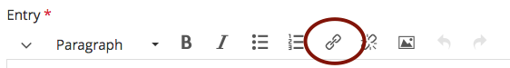

<h1>Section 1:</h1>
<h2>Introduction to HTML</h2>

Paragraph 1: HTML stands for HyperText Markup Language. It's the fundamental structural language of web pages.

Paragraph 2: HTML is quite easy to learn. All you have to remember is to write your code carefully, making sure you open and close tags correctly. Here are two basic tags to get you started:

<h3>The heading tag</h3>

The first tag is the heading tag known as h1, or heading level 1. The code is: <code style="font-size:1.1em;">&lt;h1&gt; &lt;/h1&gt;</code>. 
 Text is placed between two tags, like so: <code style="font-size:1.1em;">&lt;h1&gt; Text goes here &lt;/h1&gt;</code>. 
 The words 'Section 1:' at the top of this section are inside the h1 tags.
 To make a smaller heading, you just change the h1 to h2 in the opening and closing tags. The words 'Introduction to HTML' above are inside h2 tags. The title of this paragraph ('The heading tag') is inside h3 tags. You can go from h1 all the way down to h6, which is the smallest heading size.

<h3>The paragraph tag</h3>

Next is the paragraph tag, which looks like this:<code style="font-size:1.1em;">&lt;p&gt; &lt;/p&gt;</code>.  Again, any paragraph text is placed between the two tags, like this: <code style="font-size:1.1em;">&lt;p&gt; Text goes here &lt;/p&gt;</code>. Any text between these tags will appear as a single paragraph. You can add new paragraphs easily by opening a new paragraph tag.

Here is a new paragraph. I numbered the first two paragraphs on this page to show you where each new paragraph begins.

<h3>Tags that do not close</h3>

Some tags do not close. E.G. The code for making a single line break is simply: <code style="font-size:1.1em;">&lt;br&gt;</code>. The result looks like this. And this.  

Also, the tag for making a horizontal line across the page does not close. It is simply: <code style="font-size:1.1em;">&lt;hr&gt;</code>. The result looks like this:

 

<h1>Section 2:</h1> 
<h2>Basic text formatting with HTML</h2>

Other useful formatting tags are:

  <ul>
    <li><code style="font-size:1.1em;">&lt;strong&gt; &lt;/strong&gt;</code> for creating <strong>bold text</strong></li>
    <li><code style="font-size:1.1em;">&lt;em&gt; &lt;/em&gt;</code> for creating <em>italic text</em></li>
     <li><code style="font-size:1.1em;">&lt;u&gt; &lt;/u&gt;</code> for creating <u>underlined text</u>. It is generally used for indicating errors (e.g. <u>rong </u>spelling)</li>
    </ul>

<h2>2. Superscript</h2>

To format a date, for example 7th October, we can make use of the superscript tag to place the 'th' at the top right of the number.

<b>Example:</b> My birthday is on the 25th May.

To make the 'th' a superscript (i.e. half the size of the numbers 25 and floating at the top of the 5), simply place <code>&lt;sup&gt; ... &lt;/sup&gt;</code> around the 'th'

<h1>Section 3:</h1> 
<h2>Making lists with HTML</h2>

You will notice that in Section 2 above, I used a bullet list to layout the points.

There are two types of list you can make: <strong>unordered lists (bullets)</strong>, and <strong>ordered lists (numbers)</strong>.

<h3>Bullet lists</h3>

The HTML for unordered lists (bullets) is this:

<code style="font-size:1.1em;">&lt;ul&gt; &lt;li&gt;First item &lt;/li&gt; &lt;li&gt;Second item &lt;/li&gt; &lt;/ul&gt;</code>

Here is an example of a to-do list:

<ul>
    <li>Check my email.</li>
    <li>Do some research.</li>
    <li>Do my homework.</li>
    </ul>

Here is what the code for the above looks like in HTML:

<code style="font-size:1.1em;">&lt;ul&gt; &lt;li&gt;Check my email.&lt;/li&gt;  &lt;li&gt;Do some research &lt;/li&gt;  &lt;li&gt;Do my homework.&lt;/li&gt;  &lt;/ul&gt;</code>

<h3>Numbered lists</h3>

The HTML for ordered lists (numbers) is this:

<code style="font-size:1.1em;">&lt;ol&gt; &lt;li&gt;First item &lt;/li&gt; &lt;li&gt;Second item &lt;/li&gt; &lt;/ol&gt;</code>

Here is an example of my top three favourite books:

<ol>
    <li>A Short History of Tractors in Ukrainian.</li>
    <li>The Curious Incident of the Dog in the Night-Time.</li>
    <li>Sophie's World.</li>
    </ol>

So that's it for lists for now.

<h1>Section 4:</h1> 
<h2>Inserting links in your HTML</h2>

It's easy to insert a link. But before you do, it's important to understand the difference between <strong><em>relative</em></strong> and <strong><em>absolute</em></strong> links.

<h3>Absolute Links</h3>

An absolute link uses the full URL address of the page you want to link to. This is necessary if you are linking to a page outside of your own website.

 For example: suppose you want to link to the W3Schools HTML Tutorial. Here is the web address: <code style="font-size:1.1em;"> https://www.w3schools.com/html/html_basic.asp</code>. And I want the link text to read: <code style="font-size:1.1em;">visit the W3Schools HTML tutorial</code>

Here is the code for inserting this link:

<code style="font-size:1.1em;">&lt;a href="https://www.w3schools.com/html/html_basic.asp"&gt; visit the W3Schools HTML tutorial&lt;/a&gt; </code>

In the above code, you put the URL of the site inside double-inverted commas after href=

You then write the words for the link between the <code style="font-size:1.1em;">&gt;</code> and the <code style="font-size:1.1em;">&lt;/a&gt;</code> tags

Here is the result: <a href="https://www.w3schools.com/html/html_basic.asp">visit the W3Schools HTML tutorial</a> 

<h3>Relative Links</h3>

Relative links are used to link to pages or assets (e.g. images and files) that are within the file structure your own website. We won't cover this yet, as it can be slightly complicated.
 

So that's a brief introduction to links.

<h1>Section 5: Homework</h1> 
<h3>For homework, I'd like you to edit your GitHub page</h3>
    
Make three sections using the H1 heading style, as follows:

  <ol>
  <li><strong>Section 1:</strong> Write a paragraph describing yourself (e.g. where you come from, what you are studying, how long you have lived in London. And include a link to your QMplus Hub Page for SML209 (the text for the link should read: 'Visit my QMplus Hub page'.</li>
    <li><strong>Section 2:</strong> Write a bullet list of three things you have to do.</li>
    <li><strong>Section 3:</strong> Write a numbered list of three of your favourite things.</li>
    </ol>

Finally put a horizontal line between each section, like this:

When you have finished, post the link to your github website on your QMplus Hub Journal. <strong>Hint:</strong> You can insert links in your Journal entries by clicking the chain icon on the tools menu. Look: 

<h3>A bit stuck?</h3>

If you are struggling to understand this, visit the <a href="https://www.w3schools.com/html/html_basic.asp">W3Schools Basic HTML tutorials</a>. There you can experiment with the tags!

Well, that's it for now. Good luck! &#9786;

